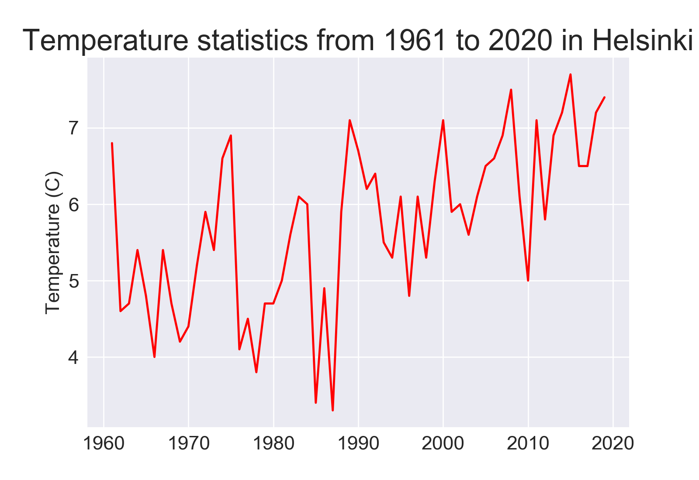

### Data Visualization
- The project is downloaded data from https://www.ncdc.noaa.gov/cdo-web/ and https://en.ilmatieteenlaitos.fi/statistics-from-1961-onwards
- Using historical weather data is a good way to learn how to work with Matplotlib, generating data from online sources.

